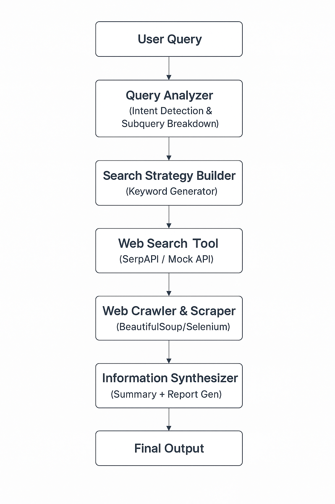

# web-research-agent

An AI-powered Web Research Agent that automatically searches the web, scrapes useful content, analyzes it, and provides comprehensive answers to user queries.

## Features

-  Extracts keywords from user queries using LLM
-  Searches the web using DuckDuckGo
-  Scrapes web pages with BeautifulSoup
-  Summarizes and synthesizes content with LLaMA-3 via Groq
-  Offers both CLI and Streamlit Web Interface

## Architecture Overview

Setup
Follow the steps below to set up and run the Web Research Agent project.
1. Clone the Repository

git clone https://github.com/yourusername/web-research-agent.git

2. Create and Activate a Virtual Environment

python -m venv venv
venv\Scripts\activate

3. Install Dependencies

pip install -r requirements.txt

4. Add Your API Key
Create a .env file in the root directory and add your Groq API Key:

GROQ_API_KEY=your-groq-api-key

5. Run the Project
Run the CLI version:
python main.py

Or launch the Streamlit UI:
streamlit run app.py

Documentation pdf is attached in git repo

Deployed the web research agent project to streamlit for public access and hereis the live link

This is the web research live link
https://web-agent-demo.streamlit.app/